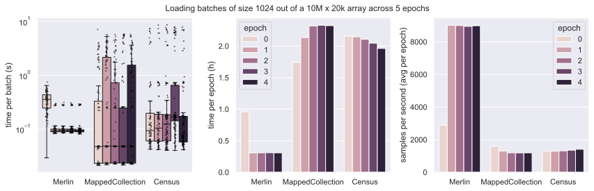
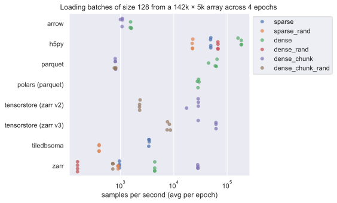
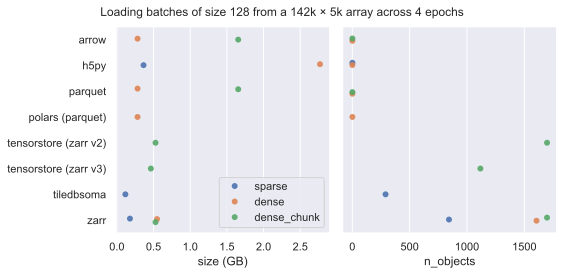
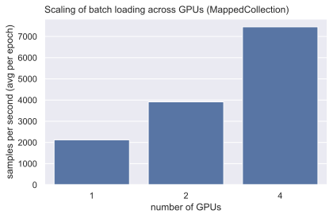
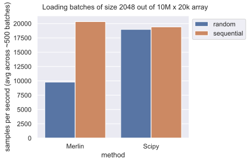
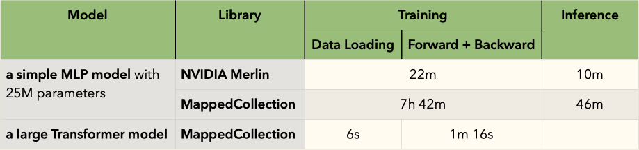
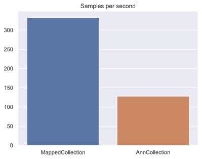

---

A few labs and companies now train models on large-scale scRNA-seq count matrices and related data modalities. But unlike for many other data types, there isn’t yet a playbook for data scales that don’t fit into memory.

We study different approaches to building data loaders and, through a series of benchmarks, identify three favorable setups:

1. **Easy & flexible:** Use weighted random sampling from a locally cached `.h5ad` collection at ~1.5k samples/sec.
2. **Fastest:** Use NVIDIA Merlin for unweighted chunked random sampling from a locally cached `.parquet` collection at ~9k samples/sec.
3. **Uncached:** If you run the training in the AWS data center that hosts the data, use `tiledbsoma` for unweighted random sampling at ~1.5k samples/sec directly from the cloud.

Hence, you can train compute-limited foundation models directly on harmonized array collections. To enable this out-of-the-box, we developed `MappedCollection`, a pytorch-compatible map-style dataset that virtually concatenates array shards. If your model is data-loading-limited because it has fewer parameters, it’s worthwhile to transform a collection of `.h5ad` files into `.parquet`. And if you don’t want to work with a cache and don’t need weighted sampling, you can transform the collection into a monolithic `tiledbsoma` array.

---

## From scVI to Transformers

If your scRNA-seq dataset still fits into memory, you can use `scvi-tools` [data loaders](https://docs.scvi-tools.org/en/stable/api/reference/scvi.dataloaders.AnnDataLoader.html) and stop reading this post. But given large-scale public & private data collection efforts like [CELLxGENE](https://cellxgene.cziscience.com/) now enable the training of deep learning models across hundreds of datasets and tens of millions of individual cells, you’re probably tempted to scale beyond data that fits into memory.

When working with large-scale scRNA-seq, you’ll likely attempt to train one of the following model classes:

1. **Multi-layer-perceptron-based models, e.g., scVI:** Models in this class are relatively small. Their training and inference time is usually limited by data loading and not by compute on a modern GPU. The amount spent loading a single batch of data into GPU memory is usually comparable to or greater than the time spent on a model's forward and backward passes.
2. **Single-cell foundation models, e.g., large-scale transformer models:** Large-scale transformer models are usually compute-limited. The amount spent on the forward and backward passes of the model is far greater than the amount of time it takes to load a single batch into GPU memory. Hence, data-loading speed is less important.

The only out-of-the-box data loader that enables to train on out-of-memory-size datasets we’re aware of is available from the `cellxgene_census` and `tiledbsoma` Python packages (see their [docs](https://chanzuckerberg.github.io/cellxgene-census/notebooks/experimental/pytorch.html)). However, it doesn’t allow you to build weighted sampling schemes and forces you to train your model within the `us-west-2` AWS data center; the loading speed is prohibitively slow outside of it.

More importantly, it’s not straightforward to train models on a combination of the CELLxGENE data and in-house datasets, typically stored as `.h5ad` files. Concatenating existing `.h5ad` collections into large `tiledbsoma` arrays requires significant data wrangling and compute.

We wanted to understand if there are less restrictive and simpler ways of setting up the model training process and realized we’d have to make 1440 decisions across 6 access layers:

| layer           | choices                                                                                      | #choices |
| --------------- | -------------------------------------------------------------------------------------------- | -------- |
| cache           | direct cloud vs. local cache (data is on AWS S3/GCP vs. data is in local cache)              | 2        |
| shuffling       | shuffling as a pre-processing step vs. random sampling from an array backend                 | 2        |
| concatenation   | collection of smaller arrays (”shards”) vs. one large concatenated array                     | 2        |
| row groups      | sampling single rows vs. row groups                                                          | 4        |
| storage backend | HDF5, Zarr, parquet, TileDB, StreamingDataset, BigQuery, Snowflake, Apache Iceberg, RDBMS, … | 9        |
| data loader     | NVIDIA Merlin, tiledbsoma, MappedCollection, AnnCollection, tensorstore, …                   | 5        |

To navigate these decisions, we performed several benchmarks.

## A large-scale benchmark

Consider a 10M x 20k array that stores vectors measuring expression of 20k genes for 10M samples (cells). We store this array as

1. a collection of 138 `.h5ad` files, streamed from a local cache with `MappedCollection`
2. a collection of 311 `.parquet` files, streamed from a local cache with NVIDIA Merlin
3. a single `tiledbsoma` array, streamed from the cloud with `cellxgene_census`

Here, `MappedCollection` is a [map-style PyTorch data loader](https://lamin.ai/docs/lamindb.core.mappedcollection) resulting in ~1.5k samples/sec, NVIDIA Merlin samples row-groups resulting in ~9k samples/sec, and `cellxgene_census` offers a [high-level PyTorch interface](https://chanzuckerberg.github.io/cellxgene-census/python-api.html) that results in ~1.5k samples/sec (**Figure 1**).

**Figure 1 ([source](https://lamin.ai/laminlabs/arrayloader-benchmarks/transform/faAhgiIDemaP4BB5))**: We compared NVIDIA Merlin based on a local collection of parquet files, `MappedCollection` based on a local collection of h5ad files, and `cellxgene_census` based on a `tiledbsoma` store in the cloud. Shown is the batch loading time (standard boxplot, **left**), the time per epoch (barplot, **center**), and the number of samples loaded per second (barplot, **right**) with statistics gathered across ~50k batch loading operations during 5 epochs for each method. The raw data consists of 138 `.h5ad` files hosted by CZI and was transformed into parquet files [here](https://lamin.ai/laminlabs/arrayloader-benchmarks/transform/GjHlkZOA4wKp5zKv). For `cellxgene_census`, we use the concatenated version `tiledbsoma` store hosted by CZI and access from within the same AWS data center `us-west-2` for maximal streaming speed ([benchmark](https://lamin.ai/laminlabs/arrayloader-benchmarks/transform/Md9ea0bLFozt65cN)). Outside of `us-west-2`, the speed is _much_ slower. We ran all benchmarks on AWS SageMaker using a `ml.g4dn.2xlarge` EC2 instance. NVIDIA Merlin runs into memory overflow during the benchmark, and we manually triggered the garbage collector.

### Sampling batches from large array collections

NVIDIA Merlin’s faster data loading speed is likely not due to the storage format but to sampling row groups (chunks) rather than isolated samples. Weighted sampling of isolated samples, however, is often needed to enrich for rare events like rare cell types, avoid overfitting certain experiments, or build other incentives into cost functions. As this is crucial for many applications, `MappedCollection` chooses single-sample access, accepting the data loading performance penalty (for more details, see Appendix).

There is another data loader for on-disk streaming of a collection of `.h5ad` files: `AnnCollection` from `anndata`. Benchmarking on a single GPU, we find that `AnnCollection` is about a factor 2 slower than `MappedCollection` (**Figure A1**) and less easy to scale to multiple GPUs.

### Sampling directly from the cloud

There are situations where it can make sense not to cache data locally while training a machine-learning model. For instance, if local storage space is limited or ad hoc queries are a frequent access pattern that complements training models. Several technologies allow streaming directly from the cloud, e.g., `tiledbsoma`, `StreamingDataset`, `zarr`, and `MappedCollection` from object stores or BigQuery & Snowflake when using integrated data warehouses. Whether live-streaming data from the cloud is a viable route depends primarily on whether you want to train models in the same cloud provider data center that hosts the data.

We trained models in the same AWS data center that hosts the CELLxGENE data (AWS `us-west-2`) and found that `tiledbsoma` then is about as fast as training with locally cached data through `MappedCollection` (**Figure 1**). Outside AWS us-west-2, however, `tiledbsoma` becomes unusably slow. `MappedCollection` can also stream from the cloud but is so slow that it can’t be used for streaming in production settings even in AWS `us-west-2` ([notebook](https://lamin.ai/laminlabs/arrayloader-benchmarks/transform/oXJWvVPX89PZ5zKv)).

We also experimented with `zarr` and `StreamingDataset` and found both performance and developer experience so bad that we didn’t invest the effort to run benchmarks at the 10M x 20k scale. The biggest problem about working with large arrays in the cloud is that significant data wrangling & compute are needed to transform sharded raw data (like a collection of `.h5ad` files) into monolithic streamable arrays. This becomes even more challenging if there are schema changes across shards or if orthogonal data types need to be integrated.

## Non-sharded loading from local array backends

To understand the performance difference in the large-scale benchmark, we thought of the simplest benchmark we could perform: measuring the time it takes to load a batch of data from a locally stored array into memory. Here, we use a single scRNA-seq expression matrix with shape 142k × 5k.

Such a single dataset is typically generated in a single wetlab study that performs a small number of experiments. In the benchmark, accessing the array through HDF5 takes the least time, and zarr, tiledbsoma & parquet are at least a factor 10 slower (**Figure 2a**).

**Figure 2a ([source](https://lamin.ai/laminlabs/arrayloader-benchmarks/transform/1GCKs8zLtkc82llI))**: Benchmarking the time for loading batches of size 128 from a 142k × 5k array across 4 epochs and a range of array backends and configurations. The benchmark was run on AWS SageMaker on a `ml.g4dn.2xlarge` instance.

Depending on the format, the dataset needs 100MB to 2.5GB of space on disk (**Figure 2b**).

**Figure 2b ([source](https://lamin.ai/laminlabs/arrayloader-benchmarks/transform/1GCKs8zLtkc82llI))**: Storage characteristics for the same dataset and array backends as in Figure 2a.

The access pattern for all backends in this benchmark differs from Figure 1. In Figure 2a, simple dataloaders pull a single batch of random indices for hdf5, zarr, and tiledbsoma every iteration without collation or pre-loading. This differs from how `Merlin`, `MappedCollection`, and the `cellxgene-census` data loaders access the underlying data to generate batches. `MappedCollection` pulls single indices and collates them into batches and `cellxgene-census` preloads contiguous chunks of indices and then shuffles them to provide batches. `Merlin` also loads contiguous chunks of indices.

## Scaling training across multiple GPUs

We investigated whether `MappedCollection` would work well for scaling training across multiple GPUs. It works out of the box, and the speedup scales directly with the number of GPUs (**Figure 3**). Streamable datasets also scale across multiple GPUs, but typically require orchestrating workers and do not support full shuffling and weighted sampling by default.

**Figure 3 ([source](https://lamin.ai/laminlabs/arrayloader-benchmarks/transform/AIJLqKqM0I4p5zKv))**: Samples per second loading from 9 `.h5ad` files with 775k samples in a Distributed Data-Parallel setup with 1, 2, and 4 NVIDIA A100 GPUs.

## Batch-loading from disk versus in-memory loading

How do data-loading times with NVIDIA Merlin compare to loading directly from memory? We compared `Merlin` to a data-loader that indexes into a sparse Scipy matrix. Similar as for the standard scVI data loader, we index into the sparse matrix in batches as this significantly speeds up access times. As expected, in-memory data loading with Scipy achieves faster loading times, especially for random access (**Figure 4**).

**Figure 4 ([source](https://lamin.ai/laminlabs/arrayloader-benchmarks/transform/DLI9rznI2PcT5zKv))**: Data loading performance during model training (with random access) and inference (with sequential loading) of the NVIDIA Merlin data loader versus standard in-memory data loading with a Scipy sparse matrix. Benchmarks were run on AWS SageMaker on an EC2 `g4dn.**2x**large` instance. The dataset consists of 10 million cells. Due to memory limitations for the in-memory data loading, the dataset is subsampled to 1.5 million cells.

## Training models

To put into perspective how data loading speed affects the overall training time for a simple MLP model with 25M parameters vs. a large Transformer model, we used the `MappedCollection` and Merlin data loaders in a full training loop. For small models, data loading speed can make overall training prohibitively slow. In contrast, for large models it’s not a bottleneck and only takes about 6s in a typical batch-wise training iteration of more than one minute (**Figure 5**).

**Figure 5**: The figure shows qualitative data gathered by two machine learning engineers in exemplary training setups. Data was aggregated in this [notebook](https://lamin.ai/laminlabs/arrayloader-benchmarks/transform/u4rLXKheYMMB5zKv). Training a simple MLP model with 25M parameters was performed in this [notebook](https://lamin.ai/laminlabs/arrayloader-benchmarks/transform/FIXTC6Mk6x137CpJ). The setup for training a Transformer model was as follows: Profiler graph showing the time taken by the data loading / forward / backward during training of a medium-size LLM for RNAseq (scPrint, unpublished work). Using a DELL7820 tower running Ubuntu 20.04 with an Intel(R) Xeon(R) Gold 5218R CPU @ 2.10GHz, 16 cores, with a 1TB SSD, 32Gb of RAM, and an NVIDIA RTX A4500, 20G GDDR6 GPU.

## Author contributions

`*` These authors contributed equally.

Sergei\* performed most benchmarks, developed `MappedCollection` and `AnnCollection`, and co-wrote the post.

Felix\* created the MLP training example and the in-memory comparison, suggested testing NVIDIA Merlin for sharded array loading, and co-wrote the post.

Maciek created the Multi-GPU benchmark and commented on the text.

Ilan contributed a benchmark for `tensorstore`.

Yanay contributed text & code on his experience with `StreamingDataset` and `mmep`.

Sunny curated most artifacts used for the benchmarks.

Chaichontat developed Sergei's notebook for the midscale benchmarks (Figure 3) into a script.

Fabian helped interpret the study results, provided feedback on the post, and supervised Felix & Ilan.

Jeremie contributed to `MappedCollection`, created the `scdataloader` package, and co-wrote the post.

Alex conceived & supervised the study and wrote the bulk of the post.

## Code & data availability

All code used in this blog post is free & open-source.

- Benchmarking scripts: [github.com/laminlabs/arrayloader-benchmarks](https://github.com/laminlabs/arrayloader-benchmarks)
- Benchmarking data: [lamin.ai/laminlabs/arrayloader-benchmarks/artifacts](https://lamin.ai/laminlabs/arrayloader-benchmarks/artifact)
- Notebooks & benchmarking runs: [lamin.ai/laminlabs/arrayloader-benchmarks/transform](https://lamin.ai/laminlabs/arrayloader-benchmarks/transform)
- `MappedCollection`: [lamin.ai/docs/lamindb.core.mappedcollection](https://lamin.ai/docs/lamindb.core.mappedcollection) or [github.com/laminlabs/lamindb](https://github.com/laminlabs/lamindb)
- `scdataloader`: [github.com/jkobject/scDataLoader](https://github.com/jkobject/scDataLoader)

CZI hosts the data on AWS S3 in `us-west-2`.

## Appendix

### Data access strategies

`MappedCollection` implements a pytorch-compatible map-style dataset, enabling lazy reading from a collection of `.h5ad` files. This implies that during batch preparation, it retrieves individual indices (observations) from a collection of `.h5ad` files and then collates them to form a batch. Although slower compared to the iterable-style approach utilized by `Merlin` and the `cellxgene-census` dataloader, this strategy allows true random sampling and weighted sampling of indices. `MappedCollection` builds a shared index of arrays similar to PyTorch `ConcatDataset`, but specialized for the `AnnData` format.

The `cellxgene-census` loads contiguous chunks of indices beforehand and shuffles indices (of observations) contained in the pre-loaded chunks for subsetting and batch provision.

Merlin similarly loads contiguous chunks from `.parquet` files to supply batches.

### AnnCollection vs. MappedCollection

**Figure A1** ([source](https://lamin.ai/laminlabs/arrayloader-benchmarks/transform/qRFAbaUl5bjk65cN))**:** Samples per second to batch-loading data from a 10M x 60k array stored as 138 `.h5ad` files (batch size is 256). `AnnCollection` is slower than `MappedCollection`. `MappedCollection` coupled with PyTorch `DataLoader` scales better than scaling across multiple GPUs, but comes with more constrained indexing compared to `AnnCollection`: it can only select one index at a time and then collate. `AnnCollection` can provide slices of jointly indexed `AnnData` objects as batches that behave more or less like `AnnData` objects but can't stream directly from a disk other than using the restrictive `AnnData`-backed mode.
