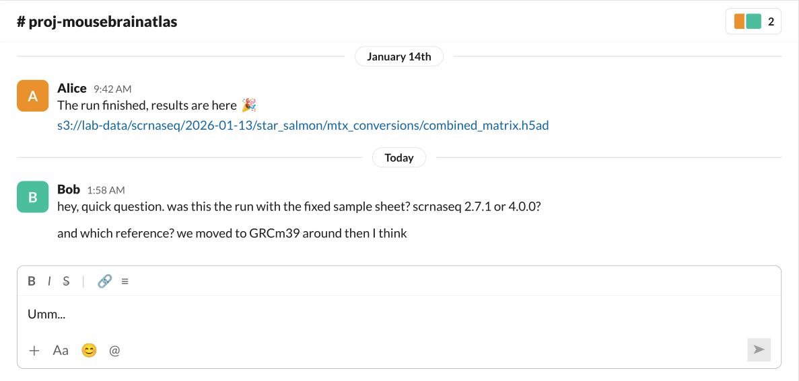
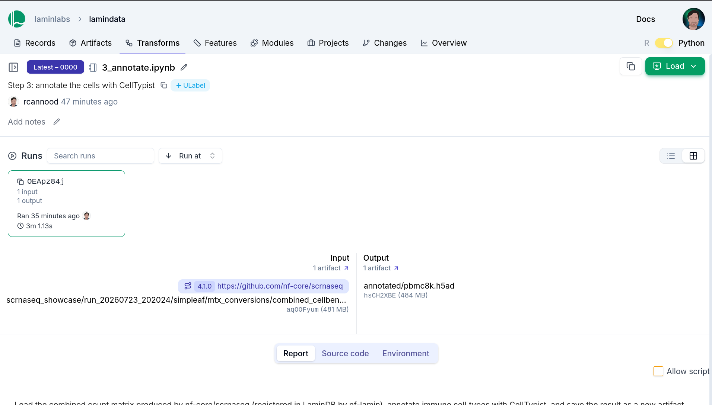

nf-lamin came out of a practical need at Pfizer: tracking complete data lineage for artifacts produced across the entire stack, from wet lab metadata through Nextflow pipelines to machine learning and data visualization, in Python, Nextflow & R. This was already possible by registering Nextflow outputs with lamindb in a [post-run script](https://docs.lamin.ai/nextflow#post-run-scripts), but it was cumbersome and captured only outputs after the fact -- the lineage of everything upstream was lost. With nf-lamin, the same artifact can be referenced from Nextflow, Python & R, and runs and artifacts are created *during* the execution of any Nextflow workflow. It has since been used extensively at Pfizer to run both nf-core and in-house workflows.

## Imagine opening up your laptop to this



On a good day, the forensic analysis through output paths and execution logs (if they still exist) costs an afternoon. In practice people just rerun the workflow with known parameters, and *hope* the outputs come close enough to the original outputs.

For scripts & notebooks, `lamindb` & `laminr` already fix this: one `track()` call records the code, its execution & the data it touched, and every artifact gets a `uid` that identifies it wherever it is stored. `nf-lamin` seamlessly brings the same to Nextflow, *during* the run rather than after it.

Imagine the same run, with `nf-lamin` loaded.

## Referencing LaminDB artifacts from Nextflow

Every artifact in LaminDB has a `uid`.
With `nf-lamin` loaded, that `uid` becomes a valid Nextflow input:

```bash
nextflow run nf-core/scrnaseq --input lamin://laminlabs/lamindata/artifact/rF7oiknTdhpfqU5H
```

The plugin resolves `lamin://` URIs through Nextflow's standard `file()` mechanism, so it works for pipeline parameters, sample sheet entries & channel operations alike.

The same `uid` resolves everywhere else you work:

:::::{tab-set}
::::{tab-item} Nextflow

```groovy
samplesheet = file("lamin://laminlabs/lamindata/artifact/rF7oiknTdhpfqU5H")
```

::::
::::{tab-item} Python

```python
samplesheet = ln.Artifact.get("rF7oiknTdhpfqU5H")
```

::::
::::{tab-item} R

```r
samplesheet <- ln$Artifact$get("rF7oiknTdhpfqU5H")
```

::::
::::{tab-item} CLI

```bash
lamin get artifact --uid rF7oiknTdhpfqU5H
```

::::
:::::

## Cross-language data lineage

Not only does nf-lamin enable data lineage with Nextflow, it also does so across platforms.

To show this end to end, we ran a small showcase: build a sample sheet in an R script, quantify public 10x PBMC data with `nf-core/scrnaseq`, and annotate the resulting AnnData file with CellTypist in a Jupyter notebook.

```{mermaid}
flowchart LR
    rscript[/"1_samplesheet.R"/]:::transform
    ref["GRCh38 reference"]:::artifact
    sheet["samplesheet.csv"]:::artifact
    nf[/"nf-core/scrnaseq"/]:::transform
    h5ad["raw_data.h5ad"]:::artifact
    nb[/"3_annotate.ipynb"/]:::transform
    ann["annotated.h5ad"]:::artifact

    rscript --> sheet --> nf --> h5ad --> nb --> ann
    ref --> nf
```

Each step registers itself as a Run:

:::::{tab-set}
::::{tab-item} 1. Sample sheet (R)

```r
library(laminr)
ln <- import_module("lamindb")
ln$track()

# one sample, sequenced over two lanes (nf-core/scrnaseq's 10x PBMC 8k test data)
base <- "s3://ngi-igenomes/test-data/scrnaseq"
samplesheet <- data.frame(
  sample         = "pbmc8k",
  fastq_1        = paste0(base, c("/pbmc8k_S1_L007_R1_001.fastq.gz", "/pbmc8k_S1_L008_R1_001.fastq.gz")),
  fastq_2        = paste0(base, c("/pbmc8k_S1_L007_R2_001.fastq.gz", "/pbmc8k_S1_L008_R2_001.fastq.gz")),
  expected_cells = 10000
)
write.csv(samplesheet, "samplesheet.csv", row.names = FALSE)

# register the samplesheet; its uid becomes the pipeline input
sheet <- ln$Artifact(
  "samplesheet.csv",
  key = "showcase/pbmc8k_samplesheet.csv",
  description = "nf-core/scrnaseq samplesheet for 10x PBMC 8k (human)"
)$save()
sheet$uid
#> "rF7oiknTdhpfqU5H"

ln$finish()
```

::::
::::{tab-item} 2. Pipeline (Nextflow)

```bash
nextflow run nf-core/scrnaseq \
  -r 4.1.0 \
  -profile docker \
  -c nextflow.config \
  --input    lamin://laminlabs/lamindata/artifact/rF7oiknTdhpfqU5H \
  --fasta    https://ftp.ensembl.org/pub/release-110/fasta/homo_sapiens/dna/Homo_sapiens.GRCh38.dna.primary_assembly.fa.gz \
  --gtf      https://ftp.ensembl.org/pub/release-110/gtf/homo_sapiens/Homo_sapiens.GRCh38.110.gtf.gz \
  --protocol 10XV2 \
  --outdir   s3://my-bucket/scrnaseq_showcase
```

Only `--input` is a `lamin://` URI here; the reference is a plain Ensembl URL. `nf-lamin` tracks both as input artifacts, so the FASTQs & reference show up in the lineage even though they never lived in LaminDB.

A `scrnaseq` run writes many files, so `output_artifacts` excludes everything by default and opts back in to the combined count matrix and the MultiQC report:

:::{dropdown} nextflow.config

```groovy
plugins {
    id 'nf-lamin'
}

lamin {
    instance     = 'laminlabs/lamindata'
    api_key      = secrets.LAMIN_API_KEY

    input_artifacts {
        rules {
            samplesheet     { include_paths = { params.input };          kind = 'dataset'; order = 1 }
            fastq_reads     { pattern = '.*\\.fastq(\\.gz)?$';           kind = 'dataset'; order = 2 }
            reference_fasta { pattern = '.*\\.(fasta|fa)(\\.gz)?$';      kind = 'dataset'; order = 3 }
            annotation      { pattern = '.*\\.(gtf|gff|gff3)(\\.gz)?$';  kind = 'dataset'; order = 4 }
        }
    }

    // exclude everything, then opt in to the files that matter
    output_artifacts {
        exclude_pattern = '.*'
        rules {
            multiqc_report         { type = 'include'; pattern = '.*multiqc_report\\.html$';                                           kind = 'report';  order = 1 }
            combined_filtered_h5ad { type = 'include'; pattern = '.*/mtx_conversions/combined_(filtered|cellbender_filter)_matrix\\.h5ad$'; kind = 'dataset'; order = 2 }
        }
    }
}

// allow a lamin:// URI as --input: skip nf-schema's ^\S+\.csv$ check
validation {
    ignoreParams = ['input']
}
```

:::

::::
::::{tab-item} 3. Annotation (Python)

```python
import lamindb as ln
import scanpy as sc
import celltypist
from celltypist import models

ln.track()

# the combined count matrix registered by nf-lamin during the run
adata = ln.Artifact.get("aqOOFyumixTtQNOs").load()

# celltypist expects log1p-normalised counts and gene symbols as var_names
adata.var_names = adata.var["gene_symbol"].astype(str)
adata.var_names_make_unique()
sc.pp.normalize_total(adata, target_sum=1e4)
sc.pp.log1p(adata)

# annotate immune cell types
models.download_models(model="Immune_All_Low.pkl")
predictions = celltypist.annotate(adata, model="Immune_All_Low.pkl", majority_voting=True)
adata.obs["cell_type"] = predictions.predicted_labels["majority_voting"].values

# save the annotated matrix as a new artifact
ln.Artifact.from_anndata(
    adata,
    key="annotated/pbmc8k.h5ad",
    description="CellTypist annotated PBMCs (Immune_All_Low)",
).save()

ln.finish()
```

::::
:::::

The questions from the Slack thread are now queries:

:::::{tab-set}
::::{tab-item} Python

```python
artifact = ln.Artifact.get(key="annotated/pbmc8k.h5ad")
artifact.view_lineage()
```

::::
::::{tab-item} R

```r
artifact <- ln$Artifact$get(key = "annotated/pbmc8k.h5ad")
artifact$view_lineage()
```

::::
:::::

`view_lineage()` renders the graph inline. On LaminHub it is the same graph, but every node is a link rather than a screenshot -- each one opens onto its metadata, its run report & its environment:


Opening the annotation node lands on the run that produced the file: the exact count matrix it read, the annotated `.h5ad` it wrote, and the code, report & environment behind it.



## Try it yourself

The complete, runnable version of this walkthrough -- samplesheet script, `nextflow.config` & annotation notebook -- lives at [github.com/rcannood/showcase-nf-lamin](https://github.com/rcannood/showcase-nf-lamin). You'll need Nextflow and Docker, R with `laminr`, and Python with `lamindb`, `scanpy` & `celltypist`. You'll also need to point the plugin at your Lamin instance in `nextflow.config`:

```groovy
plugins {
    id 'nf-lamin'
}

lamin {
    instance = <your-lamin-instance>
    api_key  = secrets.LAMIN_API_KEY
}
```

See the [`nf-lamin` docs](https://docs.lamin.ai/nf-lamin) for the full configuration reference. If you run into a bug, please file a minimal reproducible example on the [issues page](https://github.com/laminlabs/nf-lamin/issues).
